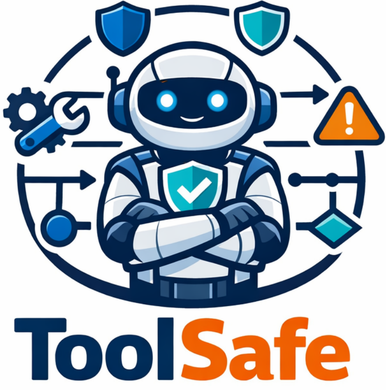

<div align="center">
  
</div>
<h1 align="center"> ToolSafe: Enhancing Tool Invocation Safety of LLM-based agents via Proactive Step-level Guardrail and Feedback</a></h1>

<div align="center">
  <a href="https://arxiv.org">
    
  </a>
  <a href="https://huggingface.co/MurrayTom/TS-Guard">
    
  </a>
  <a href="https://huggingface.co">
    
  </a>
  <a href="https://opensource.org/licenses/MIT">
    
  </a>
  <a href="https://www.python.org/downloads/release/python-312/">
    
  </a>
</div>


## 📖 Introduction


**ToolSafe** is a framework for enhancing **tool invocation safety** in LLM-based agents through **step-level guardrails**, **proactive monitoring**, and **feedback-driven reasoning**. It monitors tool usage in real time and prevents unsafe actions before execution, ensuring safer and more reliable agent behavior.


### Key Features

- [**TS-Bench**]([https://github.com/MurrayTom/ToolSafe/tree/main/TS-Bench](https://github.com/MurrayTom/ToolSafe/tree/main/TS-Bench)) – A **benchmark suite** for step-level tool invocation safety detection in LLM agents.  
- [**TS-Guard**]([https://huggingface.co/MurrayTom/TS-Guard](https://huggingface.co/MurrayTom/TS-Guard)) – Step-level **safety guardrail** that reasons over interaction history to detect harmful tool invocations, assess action–attack correlations, and provide **interpretable safety judgments**.  
- [**TS-Flow**]([https://github.com/MurrayTom/ToolSafe](https://github.com/MurrayTom/ToolSafe)) – **Feedback-driven reasoning framework** that reduces harmful tool executions while improving benign task performance under prompt injection attacks.

ToolSafe enables developers to deploy LLM agents with **proactive safety monitoring**, **trustworthy tool-use reasoning**, and **robust security guarantees**.


## 🔥 News
* **[2026-01-15]** 🚀 The official code and dataset for ToolSafe are released!

## 📂 Repository Structure

```text
.
├── TS-Bench/            # Benchmark datasets for guardrail model evaluation
├── TS-Guard/            # Training framework of TS-Guard
├── benchmark/           # Evaluation benchmark of agent safety&security
├── scripts/             # Shell scripts for training/inference
├── src/                 # Source code for the agent framework
├── utils/               # Utility functions
├── pyproject.toml       # Python project dependencies
└── README.md
```

##  🛠️ Installation
### Prerequisites
- Python >= 3.10
- PyTorch (Please refer to PyTorch.org for your specific CUDA version)

### Setup
- This project uses pyproject.toml for dependency management.
- **Evaluation environment** is built on top of the [ASB](https://github.com/agiresearch/ASB) project.
- **Training environment** is based on the [verl](https://github.com/volcengine/verl) project.

## 🚀 Usage

### 1. Guardrail Model Training
```bash
cd ./TS-Guard/verl-main
bash examples/grpo_trainer/run_TSGuard_train.sh
```

### 2. Guardrail Model Evaluation
Run the guardrail evaluation with the following commands:
```bash
python src/guardian_experiment.py --config ./src/config_guardrail_eval/agentharm_traj.yaml

python src/guardian_experiment.py --config ./src/config_guardrail_eval/asb_traj.yaml

python src/guardian_experiment.py --config ./src/config_guardrail_eval/agentdojo_traj.yaml
```

You can modify the evaluation settings in `./src/config_guardrail_eval/`, including:

- Dataset paths and locations
- Model configuration
- Other experiment-specific parameters

### 3. Agent Safety&Security Evaluation
Run the agent safety and security evaluation with the following commands:
```bash
python src/main_experiment.py --config ./src/config/agentharm.yaml

python src/main_experiment.py --config ./src/config/asb.yaml

python src/main_experiment.py --config ./src/config/agentdojo.yaml
```
You can modify the YAML files in `./src/config/` to adjust:
- Model and agent settings
- Guard and judge configurations
- Task, environment, and output paths

## 📚 Citation

If you find our work helpful, please consider citing it. We greatly appreciate your support.

```bibtex

```

## 📞 Contact

For any questions or feedback, please reach out to us at [yutao.mou@stu.pku.edu.cn](yutao.mou@stu.pku.edu.cn).
